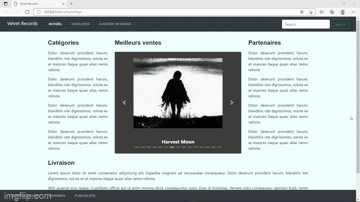
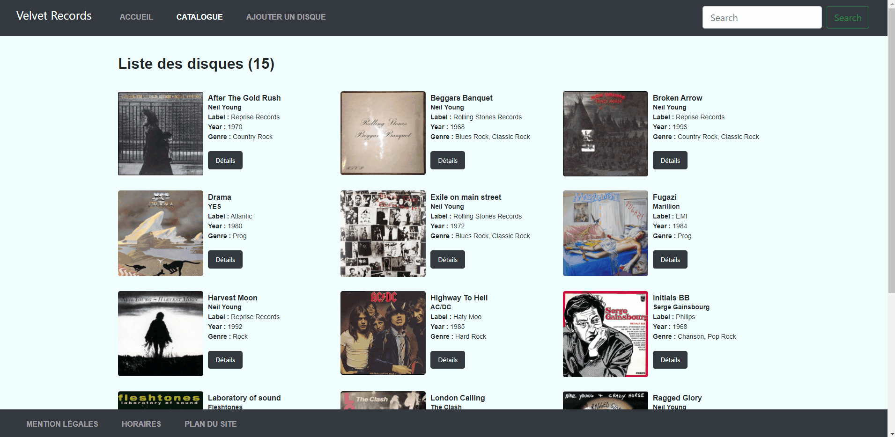
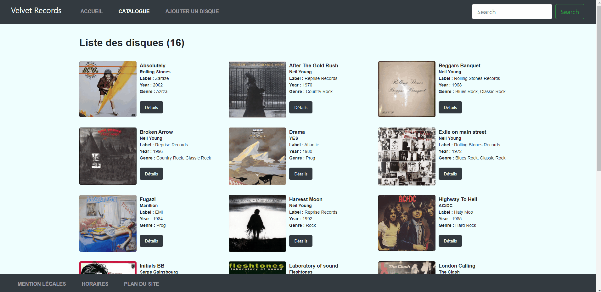

# velvet_records
Réalisation d'un CRUD en PHP POO MVC sur la BDD \*record\* afin de valider mes acquis.
> CRUD (Create - Read - Update - Delete)  
> POO (Programmation Orientée Objet)  
> MVC (Modèle - Vue - Contrôleur)  
> BDD (Base De Données)  
> PDO (PHP Data Objects)

## __Contexte:__  
Ce projet consiste à afficher, ajouter, mettre à jour ou supprimer les informations d'une BDD __SQL__ contenant la liste de CD vinyles. 
Pour ce faire, j'ai mis en place un __CRUD__ suivant l'architecture __MVC__ et entièrement réalisé en __PHP__ (sans Framework).  
J'ai aussi utilisé __CSS__ et __Bootstrap__ pour adapter et rendre le site responsive. Les fonctions d'accès à la BDD et de requêtage 
ont été réalisées via l'interface __PDO__.

## __Phase 1:__  
Réalisation de la page d'accueil du site qui affiche une sélection de disques dans un carousel d'images. 
On peut accéder aux détails d'un disque en cliquant sur son image.

  

## __Phase 2:__  
Création d'un catalogue qui affiche la liste et quelques informations de tous les disques de la bdd dans des cartes Bootstrap. 
On peut également accéder aux détails d'un disc depuis cette page.

## __Phase 3:__  
Présentation de la page contenant le formulaire de mise à jour des données d'un disque avec les vérifications nécessaires 
avant validation.

## __Phase 4:__  
Présentation de la page contenant le formulaire d'ajout d'un nouveau disque avec les éventuels contrôles avant validation.

## __Phase 5:__
Suppression d'un disque

## Présentation globale :  
Tout le site est responsive et répond aux normes W3C.

